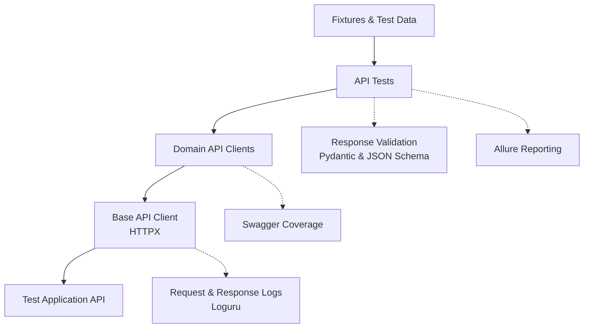

# API Test Automation Framework

[Russian](README.ru.md)

[](https://github.com/Barbaron86/autotest-api/actions/workflows/ci.yml)


API test automation framework for a learning management system, built with
**Python**, **HTTPX** and **pytest**. Typed clients, response schema validation,
reusable fixtures and parallel execution support reproducible regression testing
in a Docker environment, with reports published by GitHub Actions.

Test application: [API Course](https://github.com/Nikita-Filonov/qa-automation-engineer-api-course).

[Allure Report](https://barbaron86.github.io/autotest-api/main/) ·
[Swagger Coverage](https://barbaron86.github.io/autotest-api/swagger-coverage/) ·
[GitHub Actions](https://github.com/Barbaron86/autotest-api/actions)

## 📑 Contents

[Quick Start](#-quick-start) · [Tech Stack](#-tech-stack) ·
[Test Scenarios](#-test-scenarios) · [Architecture](#-architecture) ·
[Project Structure](#-project-structure) · [Running Tests](#-running-tests) ·
[Reports](#-reports) · [Code Quality & CI/CD](#-code-quality--cicd)

## 🚀 Quick Start

Requirements: **Python 3.12+**, **Poetry 2.x** and **Docker with Compose v2**
(supporting `--wait` and Linux containers). Docker must be running.
**Allure Commandline** is needed only to view Allure reports locally.

1. Clone the repository:

   ```bash
   git clone https://github.com/Barbaron86/autotest-api.git
   cd autotest-api
   ```

2. Create your local configuration from [.env.example](.env.example):

   ```bash
   cp .env.example .env
   ```

   On Windows PowerShell, use `Copy-Item .env.example .env`.

3. Install dependencies, start the API and run the regression suite:

   ```bash
   poetry env use 3.12
   poetry install --no-root
   docker compose up --build --wait --wait-timeout 90
   poetry run pytest -m regression
   ```

The Docker image builds the application from the revision pinned in `compose.yaml`.
Swagger UI is available at [localhost:8001/docs](http://localhost:8001/docs).

Environment variables override `.env`. If you change the port, update `API_PORT`,
`API_BASE_URL` and the `swagger_url` in `SWAGGER_COVERAGE_SERVICES` together.

Stop the environment with `docker compose down`. Volumes retain the database and
uploaded files; test fixtures close HTTP clients but do not clean up all created resources.

## 🧰 Tech Stack

| Tool | Role in the project |
| :--- | :--- |
| **Python 3.12+** | Framework and test implementation; CI runs on Python 3.12. |
| **HTTPX** | HTTP requests, connection reuse, multipart uploads and event hooks. |
| **pytest** | Test execution, fixtures, parametrization and selection by markers. |
| **pytest-xdist** | Parallel execution in separate worker processes. |
| **pytest-rerunfailures** | Optional test retries through `--reruns`; disabled by default. |
| **Pydantic** | Typed API models, strict validation, field aliases and generated JSON Schemas. |
| **Pydantic Settings** | Validated configuration from environment variables and `.env`. |
| **jsonschema** | JSON Schema Draft 2020-12 validation with format checks. |
| **Faker** | Generated emails, passwords, names and other test data. |
| **Allure / allure-pytest** | Test reports, steps, cURL attachments and environment details. |
| **Swagger Coverage Tool** | Records decorated client requests and generates OpenAPI coverage reports. |
| **Loguru** | HTTP and assertion logs with pytest worker identifiers. |
| **Poetry** | Dependencies, virtual environments and locked package versions. |
| **Ruff** | Linting, import checks and formatting. |
| **mypy** | Static type checking with strict framework settings and the Pydantic plugin. |
| **Docker Compose** | API test environment with health checks and persistent storage. |
| **GitHub Actions** | Quality checks, test execution and report publication. |
| **AI Review** | Optional OpenAI-assisted pull request review through a separate GitHub Actions workflow. |

Dependency constraints and tool settings: [pyproject.toml](pyproject.toml).
Exact package versions: [poetry.lock](poetry.lock).

## 🧪 Test Scenarios

| Area | Implemented scenarios |
| :--- | :--- |
| **Authentication** | Login with valid credentials and validation of returned tokens. |
| **Users** | Creation with different email domains and retrieval of the current user's profile. |
| **Files** | Upload, retrieval, deletion, empty filename/directory validation and invalid identifiers. |
| **Courses** | Creation, field updates and listing courses belonging to a user. |
| **Exercises** | Creation, retrieval, updates, deletion and listing exercises belonging to a course. |

Tests verify HTTP status codes, response data and JSON Schemas. Negative scenarios
check error payloads; deletion scenarios also verify that the resource is no longer available.

## 🧩 Architecture



Tests describe scenarios; domain clients encapsulate endpoints and payload serialization.
The shared `ApiClient` delegates HTTP requests to HTTPX. Fixtures prepare test resources,
while Pydantic models and shared assertions validate API responses.
HTTPX event hooks log requests and responses and attach cURL commands to Allure.
Decorated domain client methods record API operation coverage against OpenAPI.

## 📁 Project Structure

Main source and configuration files; generated reports and caches are omitted.

```text
autotest-api/
├── clients/             # Domain clients, API schemas, HTTP hooks and coverage
├── fixtures/            # API clients and generated test resources
├── tests/               # Authentication, users, files, courses and exercises
├── tools/
│   ├── assertions/      # Status, response data and JSON Schema checks
│   ├── allure/          # Report metadata and environment information
│   ├── http/            # cURL command generation
│   ├── fakers.py        # Test data generation
│   ├── routes.py        # API route constants
│   └── logger.py        # Console logging configuration
├── testdata/files/      # Upload test assets
├── docker/              # API image definition and server logging
├── .github/
│   ├── workflows/
│   │   ├── ci.yml       # Quality checks, API tests and report publication
│   │   └── ai-review.yml # Manually triggered pull request review
│   ├── actions/setup-python/action.yml # Shared Python and Poetry setup
│   └── ai-review/python-api-review.md  # API-specific review instructions
├── .ai-review.yaml      # AI provider, prompts and review settings
├── .env.example         # Example test and coverage settings
├── compose.yaml         # Docker API environment
├── config.py            # Typed configuration
├── conftest.py          # pytest plugins and logging setup
├── pyproject.toml       # Dependencies and tool configuration
└── poetry.lock          # Locked package versions
```

## ▶️ Running Tests

```bash
# Complete regression suite
poetry run pytest -m regression
# Parallel execution, as in CI
poetry run pytest -m regression --numprocesses=2
# Select a functional area
poetry run pytest -m files
# Run a single scenario
poetry run pytest tests/files/test_files.py::TestFiles::test_create_file
```

Available markers: `regression`, `authentication`, `users`, `files`, `courses`, `exercises`.
Allure results are written to `allure-results/`, which is cleared before each run.

## 📊 Reports

### Allure

Reports include test hierarchy, severity, assertion steps, cURL attachments and
runtime environment details. Open the results of the latest local run:

```bash
allure serve allure-results
```

### Swagger Coverage

Records exercised API operations against the OpenAPI specification. Keep the API
running while generating the report; clear previous requests for a fresh run:

```bash
poetry run swagger-coverage-tool clear-results
poetry run pytest -m regression --numprocesses=2
poetry run swagger-coverage-tool save-report
```

Open `coverage.html` in a browser. JSON results and coverage history are also saved;
paths are configured in `.env.example`. Log verbosity and colors can be adjusted
with `LOGURU_LEVEL` and `LOGURU_COLORIZE`.

## 🔍 Code Quality & CI/CD

Run the same quality checks used in CI:

```bash
poetry check --lock
poetry run ruff format --check .
poetry run ruff check .
poetry run mypy .
```

The [CI workflow](.github/workflows/ci.yml) validates code, starts the Docker API,
runs tests with **two workers**, generates reports and publishes available artifacts.
CI uses Python **3.12** and Poetry **2.4.3**; report and API log artifacts are retained for **14 days**.

| Trigger | Reporting |
| :--- | :--- |
| **Push to `main`** | Publishes Allure; successful full regression runs also update public Swagger Coverage and its history. |
| **Pull request to `main`** | Publishes Allure under `pr-<number>/`; generated Swagger Coverage is uploaded as an artifact. |
| **Manual run** | Runs the selected suite and uploads available reports and API logs. |

CI preserves Allure history for `main` and removes its test containers and volumes after execution.

### AI Review

The optional [AI review workflow](.github/workflows/ai-review.yml) uses
`Nikita-Filonov/ai-review` with OpenAI to review pull request changes and post
summary or inline feedback to GitHub. It runs separately from the test pipeline.

Start it from **GitHub Actions → AI Review → Run workflow**, enter the PR number
and select a review command (for example, `run-summary` or `run-inline`).
The workflow requires an `OPENAI_API_KEY` repository secret.
[.ai-review.yaml](.ai-review.yaml) configures the provider and review behavior;
[python-api-review.md](.github/ai-review/python-api-review.md) contains project-specific review instructions.
