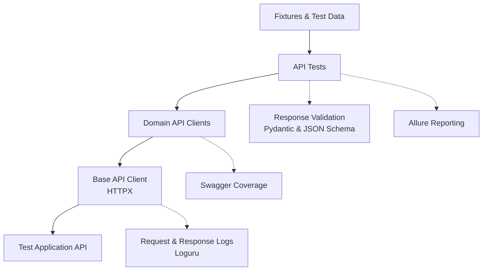

# API Test Automation Framework

[English](README.md)

[](https://github.com/Barbaron86/autotest-api/actions/workflows/ci.yml)


Фреймворк автоматизации API-тестов системы управления обучением на **Python**,
**HTTPX** и **pytest**. Типизированные API clients, проверка JSON Schema ответов,
переиспользуемые fixtures и параллельный запуск позволяют воспроизводимо выполнять
регрессионные тесты в Docker-окружении. Отчёты публикуются через GitHub Actions.

Тестируемое приложение: [API Course](https://github.com/Nikita-Filonov/qa-automation-engineer-api-course).

[Allure Report](https://barbaron86.github.io/autotest-api/main/) ·
[Swagger Coverage](https://barbaron86.github.io/autotest-api/swagger-coverage/) ·
[GitHub Actions](https://github.com/Barbaron86/autotest-api/actions)

## 📑 Содержание

[Быстрый старт](#-быстрый-старт) · [Технологии](#-технологии) ·
[Тестовые сценарии](#-тестовые-сценарии) · [Архитектура](#-архитектура) ·
[Структура проекта](#-структура-проекта) · [Запуск тестов](#-запуск-тестов) ·
[Отчёты](#-отчёты) · [Качество кода и CI/CD](#-качество-кода-и-cicd)

## 🚀 Быстрый старт

Требуются **Python 3.12+**, **Poetry 2.x** и **Docker с Compose v2**
(с поддержкой `--wait` и Linux-контейнеров). Docker должен быть запущен.
**Allure Commandline** нужен только для локального просмотра отчётов Allure.

1. Клонируйте репозиторий:

   ```bash
   git clone https://github.com/Barbaron86/autotest-api.git
   cd autotest-api
   ```

2. Создайте локальную конфигурацию из [.env.example](.env.example):

   ```bash
   cp .env.example .env
   ```

   В Windows PowerShell используйте `Copy-Item .env.example .env`.

3. Установите зависимости, запустите API и выполните регрессионные тесты:

   ```bash
   poetry env use 3.12
   poetry install --no-root
   docker compose up --build --wait --wait-timeout 90
   poetry run pytest -m regression
   ```

Docker-образ собирает приложение из версии, закреплённой в `compose.yaml`.
Swagger UI доступен по адресу [localhost:8001/docs](http://localhost:8001/docs).

Переменные окружения имеют приоритет над `.env`. При смене порта одновременно
обновите `API_PORT`, `API_BASE_URL` и `swagger_url` в `SWAGGER_COVERAGE_SERVICES`.

Остановите окружение командой `docker compose down`. Тома сохраняют базу данных
и загруженные файлы; fixtures закрывают HTTP clients, но не удаляют все созданные ресурсы.

## 🧰 Технологии

| Инструмент | Назначение в проекте |
| :--- | :--- |
| **Python 3.12+** | Реализация фреймворка и тестов; в CI используется Python 3.12. |
| **HTTPX** | HTTP-запросы, переиспользование соединений, загрузка файлов multipart и event hooks. |
| **pytest** | Запуск тестов, fixtures, параметризация и выбор тестов по markers. |
| **pytest-xdist** | Параллельное выполнение в отдельных workers. |
| **pytest-rerunfailures** | Необязательные повторные запуски через `--reruns`; по умолчанию отключены. |
| **Pydantic** | Типизированные API models, строгая валидация, field aliases и генерация JSON Schema. |
| **Pydantic Settings** | Проверяемая конфигурация из переменных окружения и `.env`. |
| **jsonschema** | Проверка по JSON Schema Draft 2020-12, включая форматы значений. |
| **Faker** | Генерация email, паролей, имён и других тестовых данных. |
| **Allure / allure-pytest** | Отчёты о тестах, шаги, вложения cURL и сведения об окружении. |
| **Swagger Coverage Tool** | Запись запросов декорированных методов клиентов и отчёты о покрытии OpenAPI. |
| **Loguru** | Логи HTTP-запросов и проверок с идентификаторами процессов pytest. |
| **Poetry** | Зависимости, виртуальные окружения и фиксация версий пакетов. |
| **Ruff** | Проверка кода, импортов и форматирования. |
| **mypy** | Статическая проверка типов со строгими настройками фреймворка и плагином Pydantic. |
| **Docker Compose** | API-окружение для тестов с проверками готовности и постоянным хранилищем. |
| **GitHub Actions** | Проверки качества, запуск тестов и публикация отчётов. |
| **AI Review** | Необязательное ревью pull request с помощью OpenAI в отдельном workflow GitHub Actions. |

Ограничения версий зависимостей и настройки инструментов: [pyproject.toml](pyproject.toml).
Точные версии пакетов: [poetry.lock](poetry.lock).

## 🧪 Тестовые сценарии

| Область | Реализованные сценарии |
| :--- | :--- |
| **Authentication** | Вход с корректными учётными данными и проверка полученных токенов. |
| **Users** | Создание пользователей с разными email-доменами и получение профиля текущего пользователя. |
| **Files** | Загрузка, получение, удаление, проверка пустого имени и каталога, некорректных идентификаторов. |
| **Courses** | Создание, обновление полей и получение списка курсов пользователя. |
| **Exercises** | Создание, получение, обновление, удаление и получение списка заданий курса. |

Тесты проверяют HTTP-статусы, данные ответов и JSON Schema. Негативные сценарии
проверяют ответы с ошибками; сценарии удаления также проверяют недоступность удалённого ресурса.

## 🧩 Архитектура



Тесты описывают сценарии; Domain API Clients скрывают детали endpoints
и сериализации данных. Общий `ApiClient` выполняет HTTP-запросы через HTTPX.
Fixtures подготавливают тестовые ресурсы, а Pydantic models и общие функции
проверок валидируют ответы API.
HTTPX event hooks записывают запросы и ответы в лог и прикрепляют cURL-команды к Allure.
Декорированные методы клиентов записывают покрытие операций API по спецификации OpenAPI.

## 📁 Структура проекта

Основные исходные файлы и конфигурация; сгенерированные отчёты и кеши не показаны.

```text
autotest-api/
├── clients/             # Domain API Clients, API schemas, HTTP hooks и покрытие
├── fixtures/            # API clients и создаваемые тестовые ресурсы
├── tests/               # Authentication, Users, Files, Courses и Exercises
├── tools/
│   ├── assertions/      # Проверки статусов, данных ответов и JSON Schema
│   ├── allure/          # Метаданные отчётов и сведения об окружении
│   ├── http/            # Генерация cURL-команд
│   ├── fakers.py        # Генерация тестовых данных
│   ├── routes.py        # Константы маршрутов API
│   └── logger.py        # Настройки консольного логирования
├── testdata/files/      # Файлы для тестов загрузки
├── docker/              # Определение API-образа и настройки логов сервера
├── .github/
│   ├── workflows/
│   │   ├── ci.yml       # Проверки качества, API-тесты и публикация отчётов
│   │   └── ai-review.yml # Ревью pull request, запускаемое вручную
│   ├── actions/setup-python/action.yml # Общая настройка Python и Poetry
│   └── ai-review/python-api-review.md  # Инструкции ревью API-проекта
├── .ai-review.yaml      # Провайдер AI, инструкции и настройки ревью
├── .env.example         # Пример настроек тестов и покрытия
├── compose.yaml         # Docker-окружение API
├── config.py            # Типизированная конфигурация
├── conftest.py          # Плагины pytest и настройка логирования
├── pyproject.toml       # Зависимости и настройки инструментов
└── poetry.lock          # Зафиксированные версии пакетов
```

## ▶️ Запуск тестов

```bash
# Полный набор регрессионных тестов
poetry run pytest -m regression
# Параллельный запуск, как в CI
poetry run pytest -m regression --numprocesses=2
# Выбор функциональной области
poetry run pytest -m files
# Запуск одного сценария
poetry run pytest tests/files/test_files.py::TestFiles::test_create_file
```

Доступные markers: `regression`, `authentication`, `users`, `files`, `courses`, `exercises`.
Результаты Allure записываются в `allure-results/`, который очищается перед каждым запуском.

## 📊 Отчёты

### Allure

Отчёты содержат иерархию тестов, критичность, шаги проверок, вложения cURL
и сведения об окружении. Откройте результаты последнего локального запуска:

```bash
allure serve allure-results
```

### Swagger Coverage

Записывает вызванные операции API относительно спецификации OpenAPI. Во время
генерации отчёта API должен работать. Для нового запуска очистите предыдущие запросы:

```bash
poetry run swagger-coverage-tool clear-results
poetry run pytest -m regression --numprocesses=2
poetry run swagger-coverage-tool save-report
```

Откройте `coverage.html` в браузере. Также сохраняются JSON-результаты и история
покрытия; пути настроены в `.env.example`. Уровень логирования и цвета задаются
через `LOGURU_LEVEL` и `LOGURU_COLORIZE`.

## 🔍 Качество кода и CI/CD

Запустите проверки качества, используемые в CI:

```bash
poetry check --lock
poetry run ruff format --check .
poetry run ruff check .
poetry run mypy .
```

[CI workflow](.github/workflows/ci.yml) проверяет код, запускает API в Docker,
выполняет тесты в **двух workers**, создаёт отчёты и публикует доступные артефакты.
В CI используются Python **3.12** и Poetry **2.4.3**; отчёты и логи API хранятся **14 дней**.

| Событие | Отчётность |
| :--- | :--- |
| **Push в `main`** | Публикует Allure; успешный полный регрессионный запуск также обновляет публичное покрытие Swagger и его историю. |
| **Pull request в `main`** | Публикует Allure в `pr-<number>/`; сформированный отчёт Swagger Coverage загружается как артефакт. |
| **Ручной запуск** | Выполняет выбранный набор тестов и загружает доступные отчёты и логи API. |

CI сохраняет историю Allure для `main` и удаляет тестовые контейнеры и тома после выполнения.

### AI Review

Необязательный [workflow AI review](.github/workflows/ai-review.yml) использует
`Nikita-Filonov/ai-review` с OpenAI для ревью изменений pull request и публикации
общего заключения или комментариев к строкам кода в GitHub. Он запускается отдельно от тестового pipeline.

Откройте **GitHub Actions → AI Review → Run workflow**, укажите номер PR
и выберите команду ревью (например, `run-summary` или `run-inline`).
Workflow требует секрет репозитория `OPENAI_API_KEY`.
[.ai-review.yaml](.ai-review.yaml) задаёт провайдера и поведение ревью;
[python-api-review.md](.github/ai-review/python-api-review.md) содержит инструкции ревью для этого проекта.
